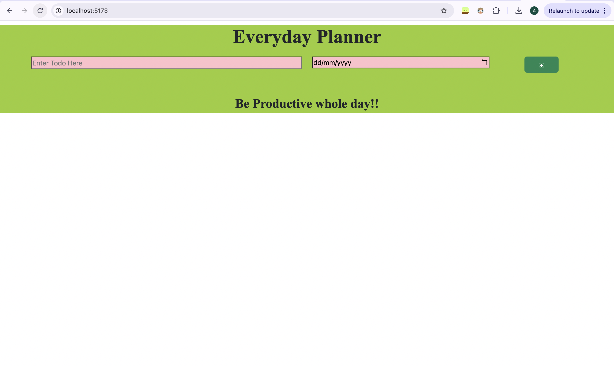

# Everyday Planner Application

This Everyday Planner Application is designed to help users efficiently manage their daily tasks. It allows users to **add**, **edit**, **delete**, and **view** tasks scheduled for the day, making task management simple and intuitive.

## Features

- **Add Tasks**: Easily add new tasks to your daily schedule.
- **Edit Tasks**: Modify existing tasks with updated information.
- **Delete Tasks**: Remove completed or unnecessary tasks from the list.
- **View Tasks**: Display a clear list of all scheduled tasks for the day.

## Technologies Used

- **React**: Utilizes various React hooks for state management and component functionality.
- **Bootstrap**: Ensures responsiveness and a mobile-friendly interface.
- **React Icon Library**: Provides a wide range of icons to enhance the user interface.

## Getting Started

To get started with the project, follow these steps:

1. Clone the repository:
   ```bash
   git clone https://github.com/your-username/everyday-planner.git
   ```
2. Navigate to the project directory:
   ```bash
   cd everyday-planner
4. Instal dependencies:
   ```bash
   npm install
6. Start the Application:
   ```bash
   npm run dev

## Learnings
This project is a great starting point for:

- Mastering React and managing state with hooks.
- Implementing responsive design using Bootstrap.

## Screenshots

